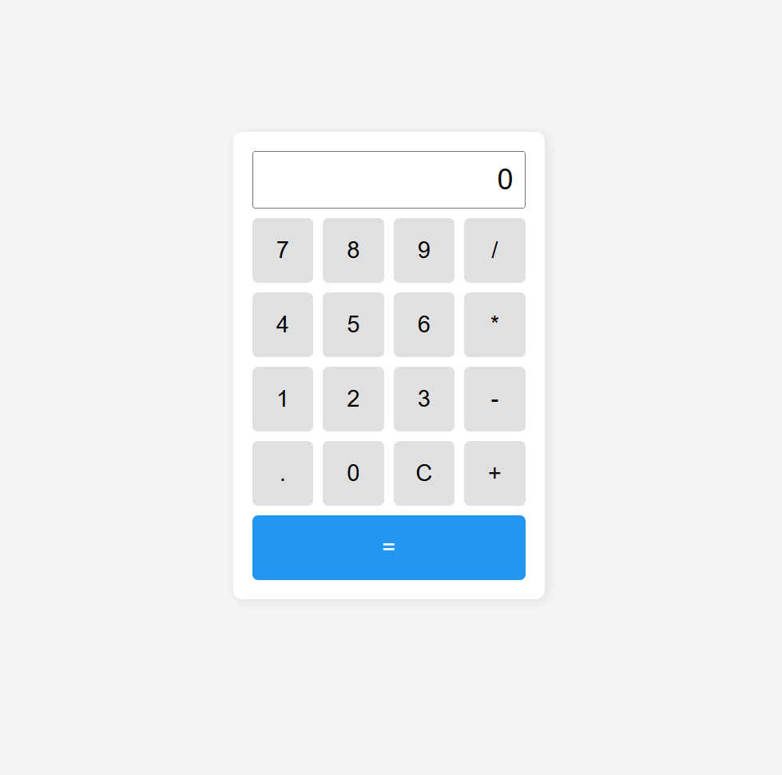
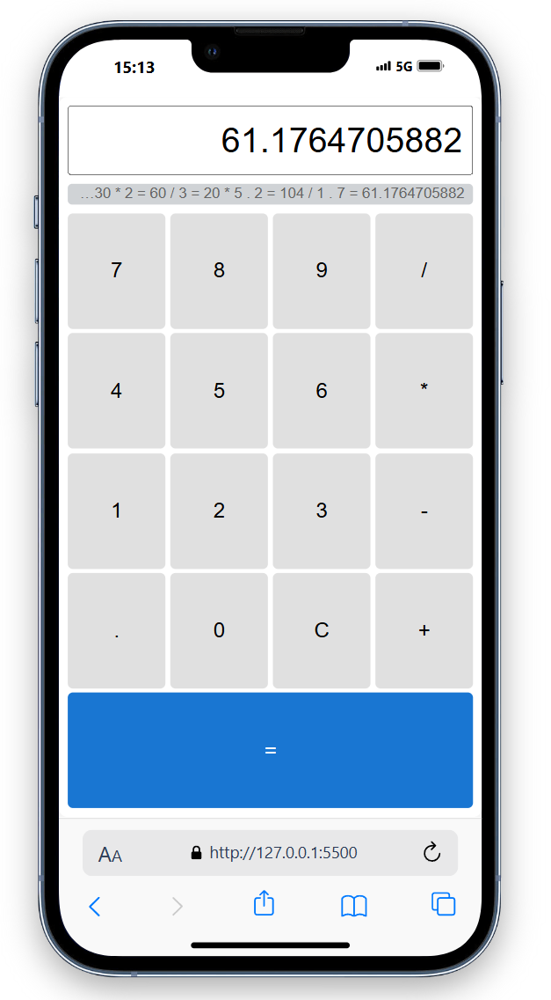

# Vanilla JS Calculator

Una calculadora básica desarrollada con **JavaScript puro**, HTML y CSS, para repasar fundamentos sin frameworks.

## 📂 Estructura

- `index.html` - interfaz de usuario.
- `style.css` - estilos con BEM-lite.
- `script.js` - lógica de la calculadora en módulo ES

## ⚙️ Tecnologías

- HTML5
- CSS3
- JavaScript (ES6+)

## 🚀 Uso local

1. Clona el repositorio:
   ```bash
   git clone https://github.com/saulvg/vanilla-js-calculator.git
   ```

## 📱 / 🖥️ Capturas

# 🖥️ Vista Desktop

<p align="center">  </p>

# 📱 Vista Móvil

<p align="center">  </p> ```
